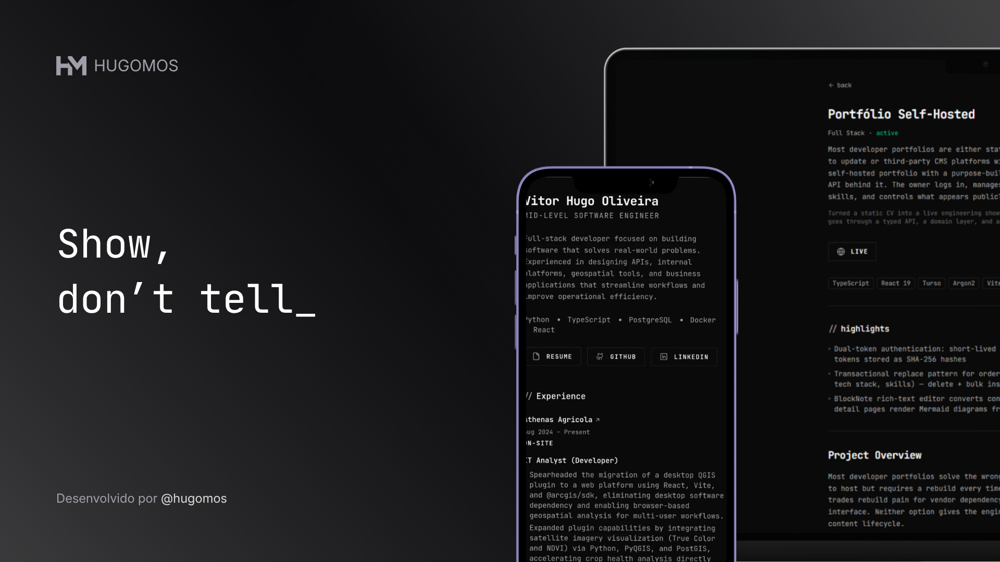

# Portfólio Self-Hosted

Portfolio pessoal self-hosted com painel de administração integrado. O proprietário faz login, gerencia projetos, experiências e habilidades por meio de uma API com camada de domínio — e controla o que aparece publicamente.

## Funcionalidades

- Página pública com hero, experiências e projetos
- Painel administrativo para gerenciar todo o conteúdo
- Editor rich-text BlockNote com renderização de diagramas Mermaid
- Autenticação dual-token: access token de curta duração e refresh token armazenado como hash SHA-256
- Padrão de substituição transacional para reordenação de itens (delete + bulk insert)
- Gerenciamento de projetos e experiências com highlights e tecnologias associadas

## Stack

| Categoria | Tecnologias |
|---|---|
| Frontend | React 19, Vite, React Router v8, TailwindCSS v4, shadcn/ui |
| Editor | BlockNote, Mermaid |
| Backend | Node.js, Fastify 5, Zod, JWT, Argon2 |
| Banco de dados | Turso (LibSQL), Drizzle ORM |
| Monorepo | Turborepo, pnpm |
| Deploy | Vercel (web), Render (server) |

## Estrutura

```
portfolio/
├── apps/
│   ├── web/             # Frontend (React + Vite)
│   └── server/          # API REST (Fastify)
├── packages/
│   ├── db/              # Schema e migrations (Drizzle ORM)
│   ├── env/             # Validação de variáveis de ambiente
│   ├── either/          # Either monad utilitário
│   └── config/          # Configurações compartilhadas
└── turbo.json
```

## Desenvolvimento

**Pré-requisitos:** Node.js, pnpm

```bash
# Instalar dependências
pnpm install

# Executar migrations
pnpm db:migrate

# Iniciar todos os apps
pnpm dev
```

Para rodar apps individualmente:

```bash
pnpm dev:server   # API (porta 3000)
pnpm dev:web      # Frontend (porta 5173)
```

Utilitários de banco:

```bash
pnpm db:studio     # Drizzle Studio
pnpm db:generate   # Gerar migrations
pnpm db:push       # Aplicar schema diretamente
```

## Variáveis de ambiente

**`apps/server`** — crie um `.env` baseado nas variáveis abaixo:

| Variável | Descrição |
|---|---|
| `DATABASE_URL` | Connection string Turso/LibSQL |
| `SERVER_URL` | URL pública da API |
| `CORS_ORIGIN` | Origem permitida pelo CORS |
| `JWT_SECRET` | Secret para tokens JWT (mín. 32 caracteres) |
| `REFRESH_TOKEN_EXPIRY_IN_DAYS` | Expiração dos refresh tokens (padrão: 30) |
| `NODE_ENV` | Ambiente de execução |

**`apps/web`** — crie um `.env` com:

```env
VITE_SERVER_URL=http://localhost:3000
```

## Deploy

- **Web:** Vercel — `pnpm build` via Turborepo, configurado em `apps/web/vercel.json`
- **Server:** Render — build via `tsdown`, entrada `dist/index.mjs`
